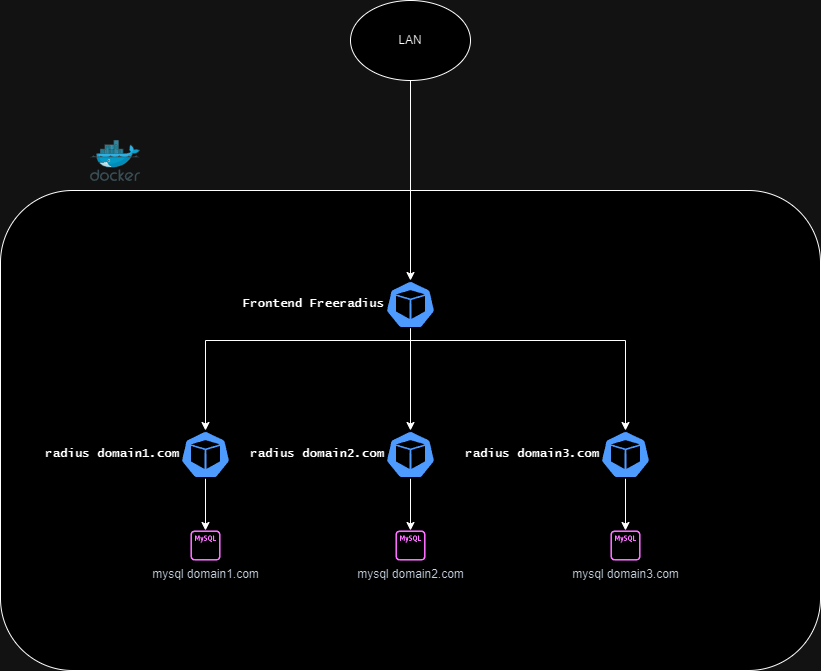

# free-radius-proxy-docker
## This is a  lab that is testing conditional proxing based on domain requests.
 
 

 ## Deploy
    Use docker compose yml to deploy localy.

## Test
    Use radtest provided by freeradius-utils to test your config radtest [username] [password] [host] 0 [secretkey]
 ### example

        radtest testing@domain1.com password localhost 0 testing123

## Configs 

You can found all the config files mounted in the docker-compose.yml

### Frontend
1. - "./configs/radius/users:/etc/raddb/users"
---
            You can also add local users on the frontend if you like
---
1. - "./configs/radius/proxy.conf:/etc/raddb/proxy.conf"
---
            realm domain1.com {
                type = radius
                secret = testing123
                authhost = freeradius1:1812
	            accthost = freeradius1:1813
                nostrip
            }
            realm domain2.com {
                type = radius
                secret = testing123
                authhost = freeradius2:1812
	            accthost = freeradius2:1813
                nostrip
            }
            realm domain3.com {
                type = radius
                secret = testing123
                authhost = freeradius3:1812
	            accthost = freeradius3:1813
                nostrip
            }
---
1. - "./configs/radius/radiusd.conf:/etc/raddb/radiusd.conf"
---
    proxy_requests  = yes
    $INCLUDE proxy.conf
---

### Backend

The local users resides on this location 
1. - "./1configs/radius/users:/etc/raddb/users"
1. - "./2configs/radius/users:/etc/raddb/users"
1. - "./3configs/radius/users:/etc/raddb/users"

# Initial docker compose and repo Source
    https://github.com/2stacks/docker-freeradius/tree/master
